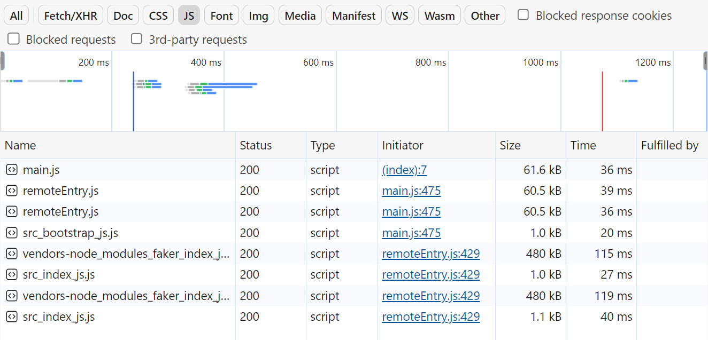
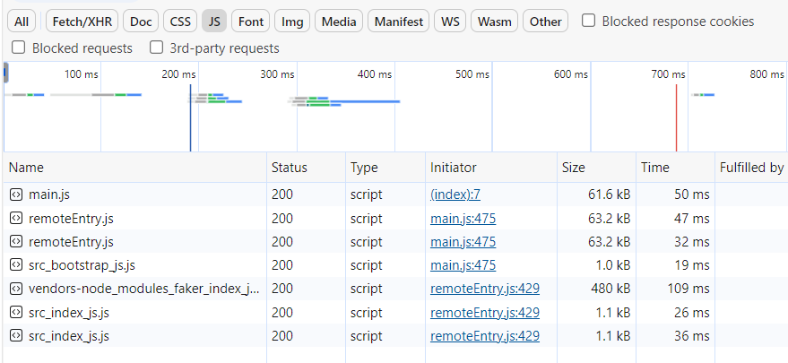

# Micro frontend architecture

In this project I will try to practice the micro-frontend capabilities and check what is possible and the cost. The ideia is to document the process, try new ideias and do it understanding the concpets and how it works.

- [X] Create a micro frontend application
- [X] Connect multiple frontends
- [ ] Deploy it
- [ ] Create a new product with different technology
- [ ] Check how authentication and autorization would work
- [ ] Make it plug and play kind of application
- [ ] Create a customization type

## Concepts

- **Build Time Integration** - Before the shell gets loaded in the browser, it gets access to micro frontends sources
- **Run Time Integration** - After the shell gets loaded in the browser, it gets acess to micro frontend sources
- **Server Integration** - Server side rendering of the micro frontend. The services are loaded in the page before the server sends the js

## First Approach

The first approach is a run time integration using webpack module federation as is the most common stack to this architecture.

### Module federation

The HtmlWebpackPlugin is a plugin used to load all the js into the HTML file as a single page app

The ModuleFederationPlugin is the one that allows micro frontends services to find each other.

We have two kind of services: the shell that wraps all the othe micro frontends and the remote that is served by the shell.

#### Shell

The libraries used in this shell were:

```sh
npm install webpack@5.88.0 webpack-cli@4.10.0 webpack-dev-server@4.7.4 nodemon html-webpack-plugin@5.5.0 --save-exact
```

In the config file we set a name just to clarity, but it is not really necessary.

A 'remotes' object lists all the services with names and its URLs, the key value is how the name the service is going to be imported with. The value is a URL that follows the patter "serice_name@url/service_file.js" the 'service_name' is name configured inside the micro frontend, url is where it is exposed and 'service_file' is the name of the file that has the service code and its name is configure in the remote.

#### Remotes

The libraries used in the remotes were:

```sh
npm install webpack@5.88.0 webpack-cli@4.10.0 webpack-dev-server@4.7.4 faker@5.1.0 html-webpack-plugin@5.5.0 --save-exact
```

In the config file of the remote, the name is going to define how other micro fronteds can call this service in its url

The file name is the name of the entry file that is holds the manifest of every service exposed by the micro frontend

The 'exposes' object holds a key-value of every aliases for each file exposed. The key is how other micro frontends can import that file specified in the value.

### Loading twice the same package

As shown in the screenshot we are loading the same 'faker' library twice in the project.



To fix that

- add the library to the shared array in the module federation configuration inside each project that uses that
- use the bootstrap pattern to asyn load the script in each project



To assert only one version of certain libraries can be loaded, the singleton option must be set to true in the shared configuration of Module federation

## Second Apprach - Using different frameworks

I am going to work in a dashboard application with authentication to try and test how to work with multiple micro frontends with authentication and different frameworks

### Problem with CSS in microfrontend apps

When building common component library generate a separate CSS file with short generic class names (like "jss2"), but between diferente builds of different projects a generic class name can be equal to another causing CSS conflict

This happens mostly in production mode, but can happen in development if different projects use the same class name

To fix that we need to create a generate class name using Material UI
